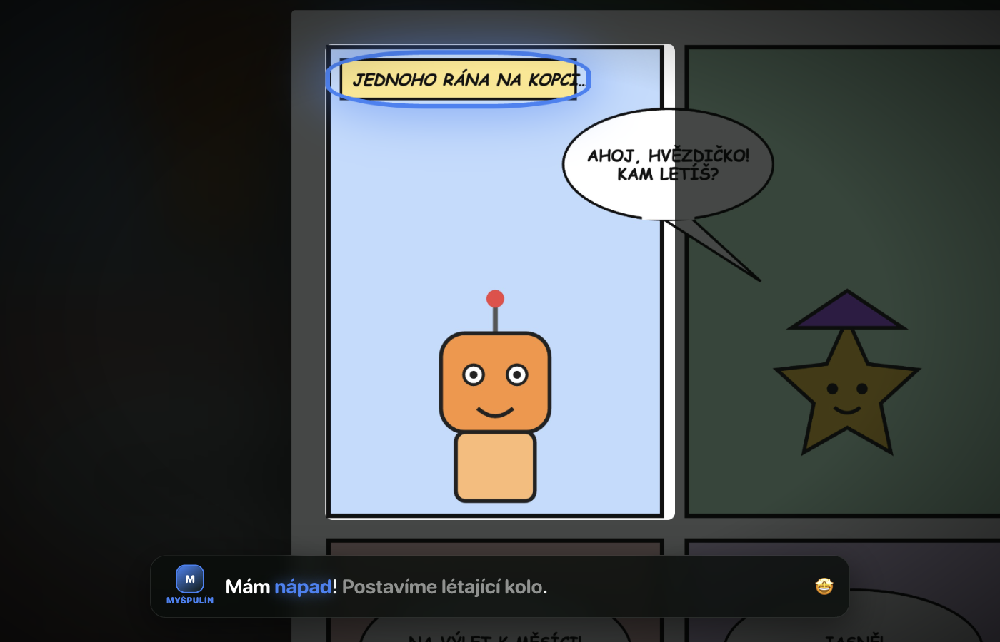
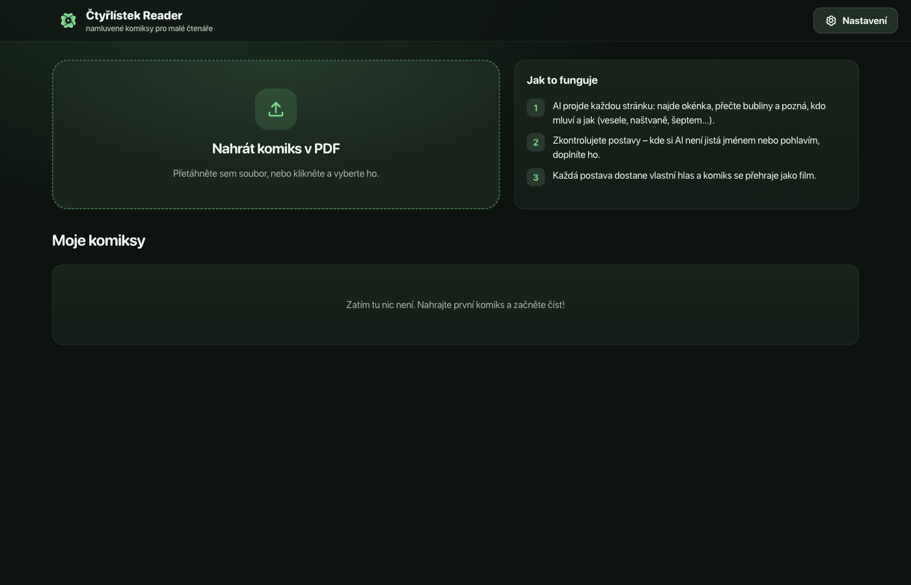
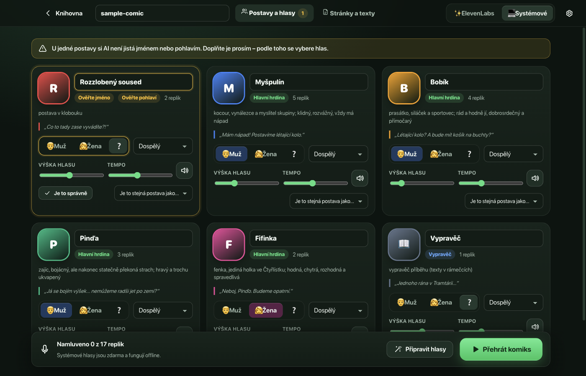
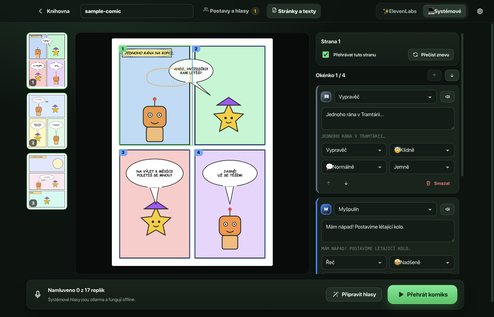
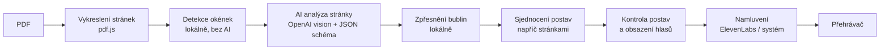

<p align="center">
  
</p>

<h1 align="center">Čtyřlístek Reader</h1>

<p align="center">
  <b>AI čtečka komiksů, která z PDF udělá namluvený komiks a přehraje ho jako film.</b><br/>
  Pro děti, které ještě nečtou – a pro rodiče, kteří nemusí předčítat pořád dokola.
</p>

<p align="center">
  <a href="https://github.com/b4rtt/ctyrlistek-reader/actions/workflows/ci.yml"></a>
  <a href="LICENSE"></a>
  
</p>

<p align="center">
  
</p>

> Snímky obrazovky používají vlastní testovací komiks (robot a hvězdička), ne skutečný Čtyřlístek.

## Co to umí

- **Nahrajete PDF** komiksu (přetažením nebo výběrem souboru).
- **AI přečte každou stránku** (OpenAI, vision): najde okénka a jejich pořadí, přepíše texty bublin i rámečků, pozná **kdo mluví** (podle ocásku bubliny a děje) a **jak** – vesele, naštvaně, vyděšeně, šeptem, křikem…
- **Rozpozná jména postav** – hrdiny Myšpulína, Fifinku, Bobíka a Pinďu zná, ostatní pozná podle oslovení („Bobíku!“ → Bobík). Kde si AI **není jistá jménem nebo pohlavím**, požádá vás o doplnění.
- **Každá postava dostane vlastní hlas** z ElevenLabs – automaticky podle pohlaví, věku a povahy, čeština má přednost. Hlas můžete změnit a poslechnout si ukázku.
- **Herecký přednes**: model `eleven_v3` dostává k replikám „audio tagy“ (`[angry]`, `[whispers]`, `[laughs]`, `[shouting]`…), takže postavy opravdu hrají.
- **Zvukové efekty**: onomatopoje jako BUM! nebo PRÁSK! se převedou na skutečný zvuk (ElevenLabs Sound Effects) a kamera se u nich zatřese.
- **Přehrávání jako film**: jedno velké tlačítko ▶. Kamera plynule najíždí z okénka na okénko, zbytek stránky ztmavne, mluvící bublina svítí barvou postavy a titulky zvýrazňují právě čtené slovo (pomáhá při učení čtení).
- **Interaktivní**: klepnutím na bublinu se replika přehraje znovu, klepnutím na okénko na něj skočíte. Pamatuje si, kde jste skončili.
- **Záložní režim bez ElevenLabs**: systémové hlasy (macOS „Zuzana“) – zdarma a offline. Postavy se odliší výškou a tempem hlasu, emoce ovlivní tempo, výšku i hlasitost.
- **Editor**: opravíte text, mluvčího, emoci, pořadí replik i okének; stránku můžete nechat přečíst znovu nebo ji z přehrávání vynechat.

| Knihovna                                          | Postavy a hlasy                                  | Editor stránek                                   |
| ------------------------------------------------- | ------------------------------------------------ | ------------------------------------------------ |
|  |  |  |

## Jak to funguje



Kombinace lokálního počítačového vidění a AI je záměrná: jazykový model skvěle čte text a chápe děj, ale přesné souřadnice mu nejdou. Okénka proto najde lokální detektor (mezery mezi panely), AI je potvrdí nebo opraví a přiřadí k nim repliky; přibližnou polohu bubliny pak lokálně „přicvakneme“ na skutečnou bublinu. Podrobnosti v [docs/ARCHITECTURE.md](docs/ARCHITECTURE.md).

## Instalace

Zatím ze zdrojového kódu (Node.js 22+):

```bash
git clone https://github.com/b4rtt/ctyrlistek-reader.git
cd ctyrlistek-reader
npm install
npm run dev
```

Vlastní instalační balíček (`release/`):

```bash
npm run dist:mac    # nebo dist:win / dist
```

## Nastavení

V aplikaci otevřete **Nastavení**:

| Služba         | K čemu                                          | Kde získat klíč                                                                    |
| -------------- | ----------------------------------------------- | ---------------------------------------------------------------------------------- |
| **OpenAI**     | analýza stránek (okénka, texty, postavy, emoce) | [platform.openai.com/api-keys](https://platform.openai.com/api-keys)               |
| **ElevenLabs** | hlasy postav a zvukové efekty                   | [elevenlabs.io/app/settings/api-keys](https://elevenlabs.io/app/settings/api-keys) |

- Klíče se ukládají **šifrovaně do systémové klíčenky** (Electron `safeStorage`). Pro vývoj lze použít i proměnné prostředí `OPENAI_API_KEY` a `ELEVENLABS_API_KEY`.
- **Model analýzy**: výchozí `gpt-6-sol` (skvělý poměr cena/přesnost); `gpt-6-astra` je nejpřesnější a zhruba 5× dražší, `gpt-6-luna` nejlevnější. Průběžný odhad ceny vidíte během analýzy.
- **Model hlasu**: výchozí `eleven_v3` (nejvíc emocí); `eleven_multilingual_v2` je stabilnější, `eleven_flash_v2_5` nejlevnější. Před namlouváním aplikace ukáže odhad spotřeby znaků a zbývající kredit. Namluvené repliky se ukládají a znovu se neplatí.
- **Tip pro nejlepší zvuk**: přidejte si do ElevenLabs účtu hlasy s ověřenou češtinou (Voice Library) – aplikace je při obsazování upřednostní.
- **Systémové hlasy (macOS)**: kvalitnější „Zuzanu (Vylepšená)“ stáhnete v _Nastavení systému → Zpřístupnění → Mluvený obsah → Systémový hlas → Spravovat hlasy_. Na Windows/Linuxu se použije hlas prohlížeče (Web Speech).

## Ovládání přehrávače

| Klávesa          | Akce                      |
| ---------------- | ------------------------- |
| `mezerník` / `K` | přehrát / pozastavit      |
| `←` `→`          | předchozí / další replika |
| `↑` `↓`          | předchozí / další strana  |
| `F`              | celá obrazovka            |
| `S`              | titulky zapnout / vypnout |
| `Esc`            | zpět do knihovny          |

Myší (nebo prstem na dotykové obrazovce): klepnutí na bublinu = přehrát znovu, klepnutí na okénko = skok na okénko, časová osa dole = posun v příběhu.

## Soukromí

- PDF, vykreslené stránky a namluvené zvuky zůstávají **jen ve vašem počítači** (složka knihovny – otevřete ji z Nastavení).
- Do **OpenAI** se posílají obrázky stránek (kvůli analýze), do **ElevenLabs** texty replik (kvůli namluvení). Požadavky na OpenAI se posílají s `store: false`.
- Aplikace nic dalšího neodesílá a nemá žádnou telemetrii.

## Vývoj

- [docs/DEVELOPMENT.md](docs/DEVELOPMENT.md) – příkazy, testy, testovací režim bez API klíčů, balení
- [docs/ARCHITECTURE.md](docs/ARCHITECTURE.md) – jak je aplikace postavená
- [CONTRIBUTING.md](CONTRIBUTING.md) – jak přispět

```bash
npm run check      # typy + lint + unit testy
npm run test:e2e   # sestaví aplikaci a projde ji end-to-end (bez API klíčů)
```

## Právní upozornění

Toto je **neoficiální** fanouškovský open-source projekt a nemá žádnou vazbu na autory ani vydavatele komiksu Čtyřlístek. Názvy a postavy patří jejich vlastníkům. Repozitář **neobsahuje žádné stránky komiksu** – aplikace pracuje výhradně s PDF, které si uživatel sám legálně pořídil, a vše zpracovává pro osobní potřebu. Testovací komiks v `test/fixtures` je vlastní originální tvorba.

## Licence

[MIT](LICENSE) © 2026 b4rtt

---

### English summary

**Čtyřlístek Reader** is an Electron app that turns a PDF of the Czech children's comic _Čtyřlístek_ into a fully voiced "motion comic". OpenAI vision reads every page (panels, balloons, speakers, emotions, character names), a local computer-vision layer makes the geometry precise, ElevenLabs gives every character an expressive voice (v3 audio tags, sound effects), and the player flies a camera from panel to panel with karaoke subtitles. A free offline fallback uses system voices. Run `npm install && npm run dev`; see [docs/DEVELOPMENT.md](docs/DEVELOPMENT.md).
